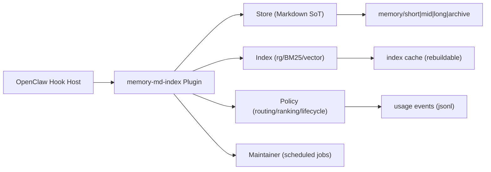

# 技术方案（Memory B++）

## 1. 目标与非目标

### 1.1 目标

1. 在不改 OpenClaw 核心逻辑前提下，增强记忆系统的可检索性、稳定性、长期收益。
2. 在现有时间分层基础上增加分类/标签和反馈强化机制。
3. 支持检索后端可替换（rg/BM25/vector），上层接口稳定不变。
4. 通过定时维护控制记忆污染和膨胀。

### 1.2 非目标

1. 不引入核心代码侵入式改造。
2. 不自动修改 `skills/` 内容，只输出 proposal。
3. 首期不引入复杂知识图数据库。

## 2. 总体架构



## 3. Hook 对应能力

1. `before_route(ctx) -> hints`

- 输入：query、session 上下文、可选用户配置。
- 输出：`domain`、`allow_tags`、`deny_tags`、`priority_paths`。
- 要求：分类失败时提供 fallback（主域 + 次域 + 全局兜底）。

2. `before_prompt_build(ctx, prompt) -> prompt`

- 输入：当前 prompt 草案。
- 行为：执行“预过滤 -> 检索 -> 重排 -> 注入”。
- 产物：固定 `<memory-context>` 块，带来源引用与截断标记。

3. `agent_end(ctx, result, trace?) -> void`

- 输入：最终回答、可选执行 trace。
- 行为：抽取结构化记忆，写回 short/mid/proposals，记录 usage 事件。

4. `maintenance.run()`

- 行为：去重、衰减、归档、索引重建、weekly consolidate。

## 4. 数据模型

## 4.1 目录规范

```text
memory/
  short/
    session_state.md
  mid/
    programming/YYYY-MM-DD.md
    ops/YYYY-MM-DD.md
    product/YYYY-MM-DD.md
  long/
    rules.md
    preferences.md
  archive/
    YYYY-MM/
  proposals/
    skills_patch_YYYY-MM-DD.md
  meta/
    usage.jsonl
    lifecycle.jsonl
```

## 4.2 条目元数据（frontmatter）

```yaml
id: mem_20260227_abc123
title: "Node 22 is required for gateway scripts"
domain: programming
tags: [node, runtime, gateway]
deny_tags: []
created_at: "2026-02-27T09:18:00Z"
updated_at: "2026-02-27T09:18:00Z"
source:
  type: conversation
  ref: session://2026-02-27/turn-14
confidence: 0.78
usage_count: 0
success_count: 0
fail_count: 0
last_used_at: null
ttl_days: 30
layer: L1
```

## 4.3 内容分层（L0/L1/L2）

1. `L0`：1~3 行结论（默认注入）。
2. `L1`：要点摘要（命中后注入）。
3. `L2`：详细内容（仅按需展开）。

## 5. 检索与重排

## 5.1 检索流程

1. 意图与域判定（from `before_route`）。
2. 候选预过滤（path/domain/tags/deny_tags/ttl）。
3. 后端检索（rg/BM25/vector 任一或组合）。
4. 重排打分。
5. 注入 topK 到 prompt。

## 5.2 重排公式（首版）

```text
final_score =
  0.45 * lexical_score
  + 0.20 * semantic_score
  + 0.15 * recency_score
  + 0.15 * usage_score
  + 0.05 * confidence
  - conflict_penalty
```

说明：

1. 如果无向量后端，`semantic_score = 0`，权重等比例转移给 lexical/usage。
2. 所有分数写入 debug log，支持可解释排查。

## 6. 强化/淘汰策略

## 6.1 事件记录

1. `retrieve_hit`：被召回进入候选。
2. `prompt_injected`：被注入 prompt。
3. `answer_cited`：被最终回答引用。
4. `task_success` / `task_fail`。
5. `user_correction`：用户纠正或否定。

## 6.2 生命周期分数

```text
lifecycle_score =
  0.4 * success_rate
  + 0.25 * usage_freq
  + 0.2 * recency
  + 0.15 * confidence
  - fail_penalty
```

阈值建议：

1. `score >= 0.75`：promotion 候选（mid -> long proposal）。
2. `0.35 <= score < 0.75`：保留 mid。
3. `< 0.35 且 30 天未使用`：归档 archive。

## 7. 定时维护任务

1. 每日 `maintain-light`

- 去重、衰减、归档候选、增量索引更新。

2. 每周 `maintain-consolidate`

- 规则提纯、冲突报告、proposal 生成。

3. 每月 `maintain-audit`

- 输出健康报告（增长率、污染率、误召回率）。

## 8. 配置设计（建议键）

```yaml
memory:
  enabled: true
  retrieve:
    backend: rg # rg|bm25|vector
    topK: 5
    maxChars: 2200
    rerank: true
  route:
    enableHints: true
    fallbackDomains: [programming, ops, product]
  writeback:
    enabled: true
    qualityGate: strict
  lifecycle:
    enableReinforce: true
    promoteThreshold: 0.75
    archiveThreshold: 0.35
    archiveInactiveDays: 30
  maintenance:
    enabled: true
    daily: true
    weekly: true
```

## 9. 风险与缓解

1. 风险：分类误判导致漏召回。

- 缓解：主域 + 次域 + 全局兜底召回窗口。

2. 风险：命中率强化导致噪声记忆被放大。

- 缓解：强化必须绑定 `task_success`，并引入负反馈扣分。

3. 风险：long 层污染。

- 缓解：long 仅接受 proposal，人审合并，不自动写入。

4. 风险：索引后端故障。

- 缓解：自动回退到 rg，保证系统可用。

## 10. 回滚策略

1. 插件总开关 `memory.enabled=false` 一键回退。
2. 检索后端可降级：vector -> bm25 -> rg。
3. 强化/淘汰可独立关闭，保留基础检索注入能力。
